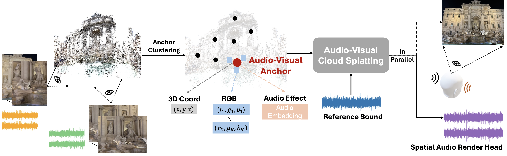

<div align="center">

<h2>AV-Cloud: Spatial Audio Rendering Through Audio-Visual Cloud Splatting [NeurIPS 2024]</h2>
<div align = "center"></div>
 <a href='https://proceedings.neurips.cc/paper_files/paper/2024/file/ff1f4141fa2a2d5d5aca6762cfbe6b57-Paper-Conference.pdf'></a> &nbsp;&nbsp;&nbsp;&nbsp;&nbsp;<a href='https://yoyomimi.github.io/AVSplat.github.io/'></a>


_**[Mingfei Chen](https://www.mingfeichen.com/), [Eli Shlizerman](https://faculty.washington.edu/shlizee/)**_

</div>

AV-Cloud is an audio rendering framework synchronous with the visual perspective. Given video collections, it constructs Audio-Visual Anchors for scene representation and transforms monaural reference sound into spatial audio.

## Enviroment
```bash
pip install -r requirements.txt
```
We use CUDA 11.4 for the experiments.

## Data and Pretrained Weights
Download our released data from [avcloud_data_release](https://www.dropbox.com/scl/fo/uq1osi0q2tmpgmspfm26x/ALkNLnLaY7756y9FHYRYjEs?rlkey=7cux8hlu704n325fxplmcltlx&st=zm0uhw6o&dl=0), unzip the data and organize them as the following structures.
```
data/avcloud_data
├── RWAVS         # processed data from RWAVS
├── ReplayNVAS
    ├──cam_imags  # colamp results and camera pose estimation for ReplayNVAS
    ├──v3         # download from raw Replay data

├── models        # pretrained rt60 estimator for evaluation
├── logs          # pretrained models (move to main folder for testing)
```
For ReplayNVAS, please download the raw data following [here](https://github.com/facebookresearch/novel-view-acoustic-synthesis?tab=readme-ov-file#data).

## Example: Train on [RWAVS](https://huggingface.co/datasets/susanliang/RWAVS)
```
bash train_rwavs.sh
```
Full AV-Cloud Model
```bash
# for video $i
CUDA_VISIBLE_DEVICES=0 python -W ignore tools/train.py --cfg configs/rwavs.yaml output_dir avcloud_full_rwavs_${i}_22050  dataset.N_points -1 dataset.video _${i} model.file avcloud model.model_type full model.render_type simple
```

AV-Cloud-SH Model
```bash
# for video $i
CUDA_VISIBLE_DEVICES=0 python -W ignore tools/train.py --cfg configs/rwavs.yaml output_dir avcloud_sh_rwavs_${i}_22050  dataset.N_points -1 dataset.video _${i} model.file avcloud model.model_type sh model.render_type simple
```

AV-Cloud-Sim-SH Model
```bash
# for video $i
CUDA_VISIBLE_DEVICES=0 python -W ignore tools/train.py --cfg configs/rwavs.yaml output_dir avcloud_simsh_rwavs_${i}_22050  dataset.N_points -1 dataset.video _${i} model.file avcloud model.model_type sim-sh model.render_type simple
```

## Example: Test on RWAVS
```
bash test_rwavs.sh
```

```bash
# for video $i full
CUDA_VISIBLE_DEVICES=0 python -W ignore tools/test_rwavs.py --cfg configs/rwavs.yaml  output_dir avcloud_full_rwavs_${i}_22050  dataset.N_points -1 dataset.video _${i} model.file avcloud model.model_type full model.render_type simple model.resume_path logs/avcloud_full_rwavs_${i}_22050/avcloud_full_rwavs_${i}_22050/100.pth

# for video $i sh
CUDA_VISIBLE_DEVICES=0 python -W ignore tools/test_rwavs.py --cfg configs/rwavs.yaml  output_dir avcloud_sh_rwavs_${i}_22050  dataset.N_points -1 dataset.video _${i} model.file avcloud model.model_type sh model.render_type simple model.resume_path logs/avcloud_sh_rwavs_${i}_22050/avcloud_sh_rwavs_${i}_22050/100.pth

# for video $i simple-sh
CUDA_VISIBLE_DEVICES=0 python -W ignore tools/test_rwavs.py --cfg configs/rwavs.yaml  output_dir avcloud_simplesh_rwavs_${i}_22050  dataset.N_points -1 dataset.video _${i} model.file avcloud model.model_type simple-sh model.render_type simple model.resume_path logs/avcloud_simplesh_rwavs_${i}_22050/avcloud_simplesh_rwavs_${i}_22050/100.pth
```
Average metrics for 13 scenes of RWAVS
```bash
python tools/av_metrics.py --log-dir avcloud_[full/sh/simple-sh]_rwavs
```


## Citation
```
@inproceedings{NEURIPS2024_ff1f4141,
 author = {Chen, Mingfei and Shlizerman, Eli},
 booktitle = {Advances in Neural Information Processing Systems},
 editor = {A. Globerson and L. Mackey and D. Belgrave and A. Fan and U. Paquet and J. Tomczak and C. Zhang},
 pages = {141021--141044},
 publisher = {Curran Associates, Inc.},
 title = {AV-Cloud: Spatial Audio Rendering Through Audio-Visual Cloud Splatting},
 url = {https://proceedings.neurips.cc/paper_files/paper/2024/file/ff1f4141fa2a2d5d5aca6762cfbe6b57-Paper-Conference.pdf},
 volume = {37},
 year = {2024}
}

```

## License
This software is free for non-commercial, research and evaluation use under the terms of the LICENSE.md file. Third-party licenses are listed in the 3RD-party license files (named LICENSE-3RD-PARTY-XX), and any modifications—along with the original source-code license—are noted in the headers of the corresponding files.


## Acknowledgment
We use datasets and part of the codes from [gaussian-splatting](https://github.com/graphdeco-inria/gaussian-splatting), [ViGAS](https://github.com/facebookresearch/novel-view-acoustic-synthesis), [AVNeRF](https://github.com/liangsusan-git/AV-NeRF) and [detr](https://github.com/facebookresearch/detr). We thank the authors for sharing their code and datasets. If you use our codes, please also consider citing their nice works.

## Contact
If you have any comments or questions, feel free to contact Mingfei Chen (lasiafly@uw.edu)

